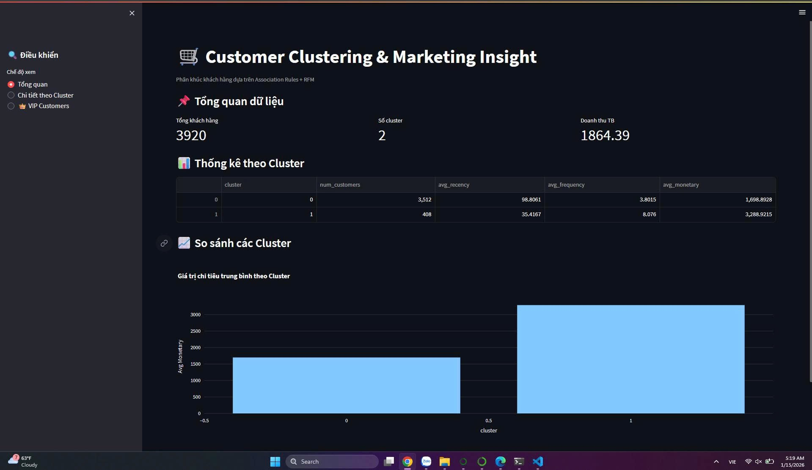
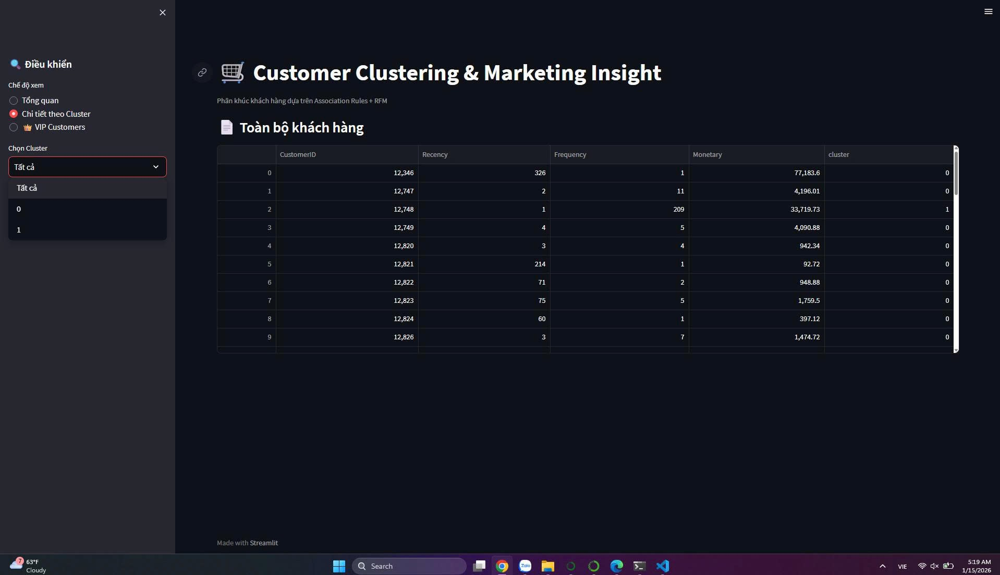
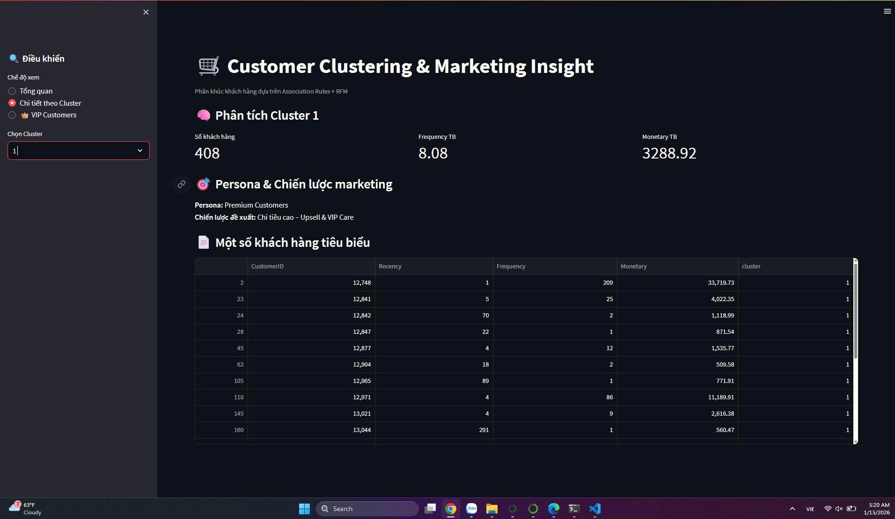
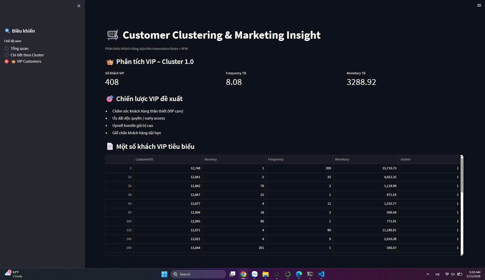

# 📊 Mini-Project: Phân cụm khách hàng từ Luật kết hợp

## 👥 Thông tin Nhóm
- **Nhóm:** 8 – CNTT 17-10  
- **Thành viên:**
  - Nguyễn Thế Ngọc  
  - Nguyễn Văn Hiệp  
  - Phạm Văn Minh  
  - Nguyễn Lê Đăng Khánh  
- **Thời gian thực hiện:** 12/2025 – 01/2026  

---

## 🎯 Mục tiêu
Phân cụm khách hàng dựa trên hành vi mua hàng thực tế thông qua **Luật kết hợp (Association Rules)** kết hợp với **RFM**, từ đó xây dựng chiến lược marketing phù hợp cho từng nhóm khách hàng.

---

## 🧠 Ý tưởng (Feynman Style)
Association Rules giúp trả lời câu hỏi:

> Nếu khách hàng mua sản phẩm A, họ có xu hướng mua thêm sản phẩm nào?

Mỗi khách hàng sẽ kích hoạt một tập luật kết hợp, tạo thành **“dấu vân tay mua sắm”** phản ánh sở thích thực tế, không chỉ dựa trên tổng chi tiêu.

---

## 🧭 Pipeline tổng thể
1. Làm sạch dữ liệu
2. Tạo basket matrix
3. Khai thác Association Rules (Apriori)
4. Feature Engineering (Rules + RFM)
5. Chuẩn hóa dữ liệu
6. Phân cụm bằng K-Means
7. Phân tích & gán Persona
8. Trực quan hóa bằng Streamlit

---

## 🧹 Tiền xử lý dữ liệu
- Lọc khách hàng tại **United Kingdom**
- Loại hóa đơn hủy (`InvoiceNo` bắt đầu bằng `C`)
- Loại số lượng và giá trị âm
- Loại `CustomerID` bị thiếu

**Sau làm sạch:**
- Tổng khách hàng: **3,920**
- Tổng cụm: **2**
- Doanh thu trung bình: **1,864.39**

---

## 🔍 Khai thác Association Rules
- Thuật toán: **Apriori**
- Metric chính: `support`, `confidence`, `lift`
- Chọn **Top luật có lift cao** làm đặc trưng cho khách hàng

---

## 🧩 Feature Engineering
- Vector đặc trưng dựa trên:
  - Luật kết hợp (binary / weighted)
  - RFM (Recency – Frequency – Monetary)
- Chuẩn hóa dữ liệu trước khi phân cụm

---

## 🔢 Phân cụm khách hàng
- Thuật toán chính: **K-Means**
- Số cụm tối ưu: **K = 2**
- Đánh giá bằng Silhouette Score

---

## 📊 Dashboard Streamlit

### 🔹 Tổng quan dữ liệu

---

### 🔹 Danh sách toàn bộ khách hàng

---

### 🔹 Phân tích Cluster 0 – Frequent Buyers
- Số khách hàng: **3,512**
- Frequency TB: **3.8**
- Monetary TB: **1,698.89**
- Persona: **Frequent Buyers**
- Chiến lược: Bundle + Loyalty

---

### 🔹 Phân tích Cluster 1 – Premium Customers
- Số khách hàng: **408**
- Frequency TB: **8.08**
- Monetary TB: **3,288.92**
- Persona: **Premium Customers**
- Chiến lược: Upsell + VIP Care

---

### 🔹 Nhóm khách hàng VIP
- VIP thuộc **Cluster 1**
- Doanh thu và tần suất cao nhất
- Đề xuất chăm sóc riêng

---

## 🌐 Demo ứng dụng
🔗 **Streamlit App:**  
http://192.168.105.248:8501

---

## 📂 Cấu trúc dự án
shop_cluster_nhom8/
│
├── app.py
├── README.md
├── images/
├── data/
│ ├── raw/
│ └── processed/
├── notebooks/
└── requirements.txt

---

## ✅ Kết luận
Dự án đáp ứng đầy đủ yêu cầu Mini Project:
- Có khai thác Association Rules
- Có Feature Engineering
- Có phân cụm khách hàng
- Có dashboard trực quan
- Có chiến lược marketing rõ ràng

➡️ Phù hợp để báo cáo & demo học phần.
